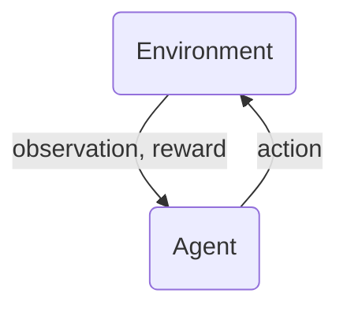
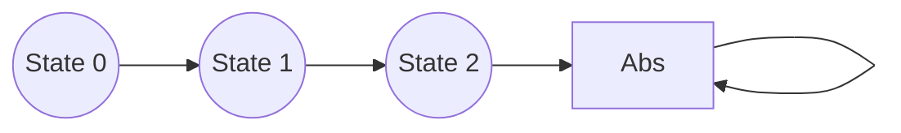

---
tags:
- programming/machine-learning/reinforcement-learning
alias:
- RL
- rl
---
# Overview
Reinforcement Learning is done by an Agent interacting with an environment and through reinforcement off certain behaviours becomes proficient in tasks. Reinforcement learning agents that are trained with a state input are called markov decision processes.

The Agent is presented with a observation of the current state of the environment and decides on an action to take. Once an action has been taken the Agent recieves a new observation which represents the now changed state of the environment and a reward determining how good the action was

Beyond the agent and the environment, on can identify four main subelements of a reinforcement learning system: 
- policy
- reward signal
- value function
- environment model

## States and Observations
A state is a complete description of the world in which no information ist hidden. An observation is a partial description of the state. When the agent is able to observe the complete state of the environment, we say that the environment is **fully observed**. When the agent can only see a partial observation, we say that the environment is **partially observed**.\

## Action Spaces
An action space defines the all of the actions the agent can take. These action spaces can be **discrete** or **continuous** 

# [[Policies]] 
A Policy defines the learning agent's way of behaving at a given time. Roughly speaking a policy is a mapping from perceived states of the environment to actions to be taken when in those states.

A Policy is like an instruction list that tells an agent what actions to take. It can be deterministic in which case it is denoted by
$$a_t = \mu(s_t) $$ or stochastic:
$$a_t \texttildelow \pi(\cdot|s_t) $$
In deep RL these are **parameterized policies** whose outputs are computable functions that depend on a set of parameters which we can adjust to change the behavior via some optimization algorithm. This is for example the weights and biases. 

Often these parameters are denoted with $\theta$ or $\phi$ 

# [[Value Functions]]
The value of a state is the amount of expected reward that a state, or an action will lead too. 

# Trajectories
A trajectory, denoted with $\tau$, is a sequence of states and actions in the world:
$$\tau =(s_0,a_0, s_1, a_1, ...)$$
the first state is randomly sampled from the start-state distribution denoted by $\rho_0$  

## Reward and Return 

the reward function $R$ depends on the current state of the world the action just taken and the newt state of the world

The goal of the agent is to maximize some naotion of cumulative reward over a trajectory. 

### Finite horizon undiscounted return 
One kind of return if the finite-horizon undiscounted return which is just the sum of rewards obtained in a fixed window of steps.
$$R(\tau) = \sum^T_{t=0} r_t$$
### Infinite horizon discounted return
Another is the infinite-horizon discounted return whidch is the sum of all rewards ever  obtained but discounted by how far in the future they were.
$$R(\tau)= \sum^{\infty}_{t=0}\gamma^t r_t$$
this discounting is practical since the agent is encouraged to maximize current reward. It also helps the agent to converge

# Episodic and Continuing Tasks
Reinforcement learning tasks can be split into two kinds, one where the agent-environment interaction naturally breaks down into a sequence of separate episodes (episodic tasks) and one where it does not (continuing tasks). 

## Unified Notation
To be precise about episodic tasks requires some additional notation. Since the continuing tasks require summing over an infinite number of terms we apply a trick, when dealing with episodic tasks, of an absorbing state which returns $0$ when the  episode is over

Doing so results in infinite sums being applyable to both.