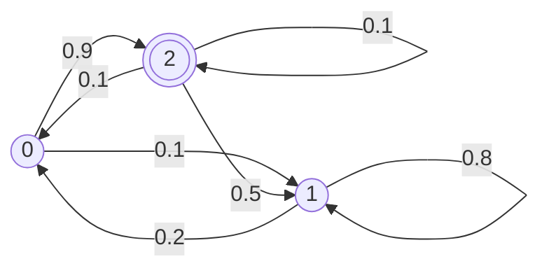

---
tags:
- math/statistics
- math/graph-theory
---
Markov chains are a type of Markov model and as such fullfill the [[Markov Properties]]. They are a graph that can predict the likelihood to land in an absorbing state while performing a [[Directed Graphs#Walks|random walk]].

In particular Markov chains are a simplified [[Markov Decision Process]]

a Markov Chain can be described using a [[Directed Graphs|directed graph]] for example:

---
## Reference

