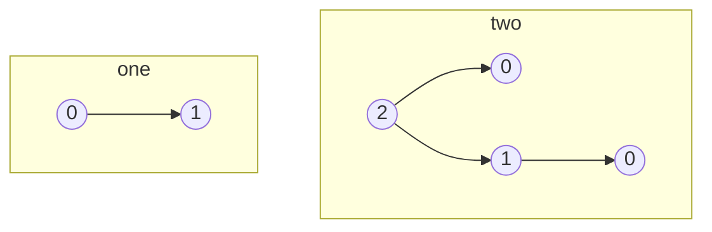

---
tags:
- math/set-theory
- math/graph-theory
---
[[Pointed Graphs|Accessible pointed graphs]] can be used as pictures of a [[Set]]. These can form downward growing trees. For example if we use the standard set theoretical representation of the [[Natural Numbers]], where the natural number $n$ is represented as the set of natural numbers less than $n$,then we have the following pictures.

A decoration of a graph is an assignment of a set to each node of the graph in such a way that the elements of the set assigned to a node are the sets assigned to the children of that node. 

A Picture of a set is an apg which has decoration in which the set is assigned to the point.

To show this let look at following example
![[Pasted image 20230725153025.png]]
0. since 0 doesnt have any chlidren it is assigned the $\emptyset$ in any decoration
1. the central node (1.) has one child $0$ and gets set $\set{0}$ where $0=\emptyset$ 
2. children are 0 and 1 so the set is $\set{\set{0}, 0}$
3. gets $\set{\set{\set{\emptyset}, \emptyset}, \set{\emptyset}, \emptyset}$ 

 

----
## References
[[@aczelNonwellfoundedSets1988]]